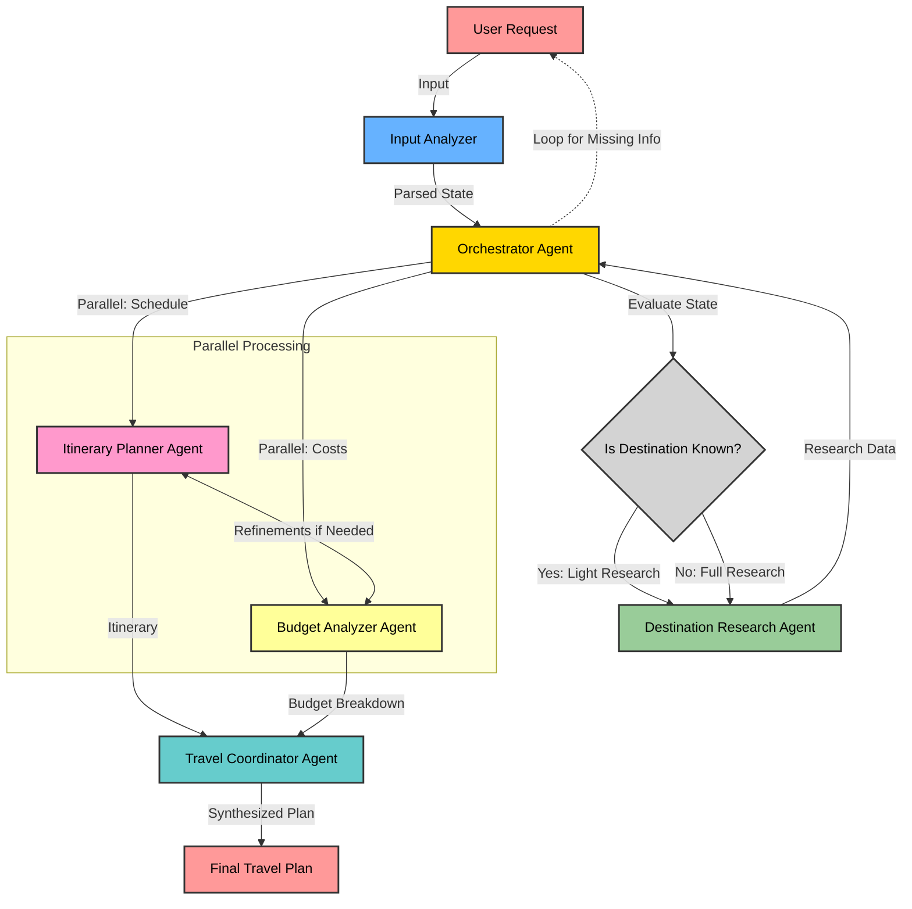
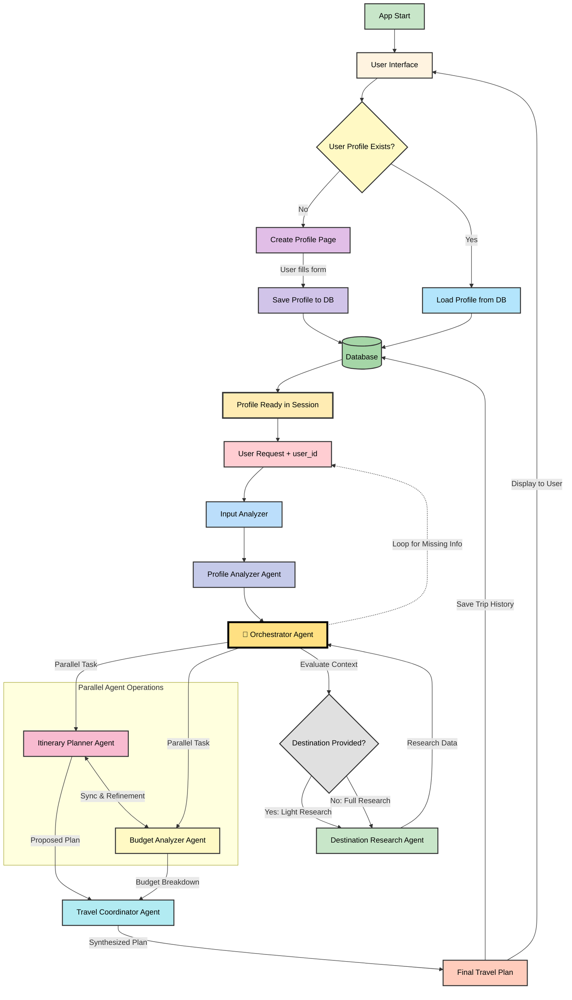

# 🌍 GlobeGenie - AI Travel Planning Assistant

An intelligent, agentic AI system that plans personalized travel itineraries through multi-agent coordination, budget optimization, and conversational intelligence.

---

## ✨ What We Built

GlobeGenie is a complete end-to-end travel planning system that:

* **Understands natural language**: Describe your trip casually, system extracts all details
* **Routes intelligently**: Automatically decides between light research (specific destinations) or full research (vague requests with destination suggestions)
* **Creates detailed itineraries**: Day-by-day schedules with activities, timings, locations, and costs
* **Optimizes within budget**: Iterative refinement loop that reduces costs when over budget
* **Coordinates multiple agents**: Six specialized agents working together seamlessly via LangGraph
* **Generates polished plans**: Complete with booking recommendations, travel tips, packing lists, and next steps

---

## 🏗️ Architecture

### Multi-Agent System

**Input Analyzer**

* Parses natural language into structured trip details
* Handles vague inputs with intelligent defaults
* Extracts: destination, duration, budget, travelers, preferences, trip type

**Destination Researcher**

* Two modes: light research (specific destinations) or full research (suggestions)
* Provides attractions, local tips, best time to visit, cultural notes, cost estimates

**Itinerary Planner**

* Creates realistic day-by-day schedules
* Balances activity intensity with downtime
* Two prompts: normal planning and cost-optimization mode

**Budget Analyzer**

* Calculates actual costs from itinerary activities
* Accurate breakdown: flights, accommodation, meals, activities, transport
* Compares against budget constraints

**Travel Coordinator**

* Synthesizes all components into final plan
* Adds booking recommendations, travel essentials, packing lists

**Orchestrator**

* Manages workflow with LangGraph state graphs
* Conditional routing based on destination specificity
* Runs optimization loop until convergence

---

## 🧠 State Management

* **Pydantic models** for type safety and validation
* **Immutable state updates** via `model_copy()` for LangGraph compatibility
* **Progress tracking** through agent status fields

---

## 🔁 Optimization Loop

The core innovation — budget ↔ itinerary refinement:

* **Budget-first priority**: Always respects financial constraints
* **Convergence detection**: Stops when cost within ±5% of budget
* **Dynamic iteration**: 2–5 loops based on complexity, extendable on user feedback
* **Smart cost reduction**: Switches to optimization prompt with specific strategies

---

## 🎯 How It Works

```
User Input → Extract Details → Evaluate Specificity → 
Light/Full Research → Parallel Planning (Itinerary + Budget) → 
Optimization Loop (if needed) → Final Coordination → User Feedback
```

**Example Flow:**

1. Input: "relaxing vacation somewhere warm, $3000 budget"
2. System: Destination vague → full research → suggests 3 tropical destinations
3. Picks best match for budget (Phuket, Thailand)
4. Creates 7-day itinerary (~$3500)
5. Detects over budget → runs optimization
6. Reduces to $2500 with free beaches, budget dining
7. Converges → generates final plan

---

## 📁 Project Structure

```
globegenie/
├── agent/              # 6 specialized agents + orchestrator
├── core/               # LLMClient, prompt library, optimization loop
├── state/              # TripState Pydantic model
├── prompt/             # 10+ specialized prompts for each agent
├── ui/                 # Streamlit interface with tabbed results
├── tools/              # Placeholder for future API integrations
├── db/                 # Database models (feedback, trips, profiles)
└── docs/               # System flow diagram
```

---

## 🛠️ Tech Stack

* **Orchestration**: LangGraph for stateful multi-agent workflows
* **LLM**: Groq (Llama 3.1-8B) for fast, cost-effective inference
* **State**: Pydantic for type-safe state management
* **UI**: Streamlit for rapid prototyping
* **Prompts**: Modular prompt library with cost-optimization variants

---

## 📊 Key Learnings

### Technical Challenges Solved

1. **LangGraph + Pydantic compatibility**: Used `model_copy(update={...})` for immutable state updates
2. **JSON parsing reliability**: Robust parser handles markdown, comments, truncated responses
3. **Budget analyzer accuracy**: Calculates from actual itinerary activities, not generic estimates
4. **Optimization context passing**: Separate prompts for normal vs. cost-reduction modes
5. **State persistence**: Proper return handling to extract updated state from LangGraph dict

### Design Decisions

* **Budget-first approach**: Most users have fixed budgets, so prioritize cost optimization
* **Immutable state**: Prevents LangGraph state management issues
* **Modular prompts**: Easy to iterate and improve without touching code
* **User feedback as safety valve**: When optimization can't converge, ask user for input

---

## 🚀 Future Enhancements

### Phase 2 - Real-time Data

* **Live flight prices** via Skyscanner/Kayak APIs
* **Hotel availability** via Booking.com/Airbnb APIs
* **Activity booking** via GetYourGuide/Viator
* **Weather forecasts** for optimal travel timing

### Phase 3 - Personalization

* **User profiles**: Remember preferences, past trips, favorite destinations
* **Preference learning**: Improve recommendations based on feedback patterns
* **Collaborative filtering**: “Users like you also enjoyed...”


## 📝 Example Output

**Input**: "5-day beach vacation to Bali with $4000 budget for 2 people"

**Output**:

* ✅ Destination: Bali, Indonesia
* ✅ 5-day itinerary: Kuta Beach, Uluwatu Temple, Mount Batur, etc.
* ✅ Total cost: $2500 (within budget)
* ✅ Per person: $1250
* ✅ Status: Finalized (no optimization needed)
* ✅ Complete plan with booking links, tips, packing list

---

## 🎓 What Makes This Unique

1. **True multi-agent orchestration**: Not just chaining LLM calls, but coordinated agents with specialized roles
2. **Budget optimization loop**: Iterative refinement until convergence or max attempts
3. **Adaptive routing**: Smart decision between light/full research based on input specificity
4. **Production-ready patterns**: Proper state management, error handling, immutable updates
5. **End-to-end system**: From raw text input to polished, actionable travel plan

---

## 🧩 Flow Chart (Phase 1)



---


## 🧩 Flow Chart (Phase 2)




**GlobeGenie v1** — A complete agentic AI travel planner demonstrating practical LLM orchestration, budget optimization, and multi-agent coordination.

